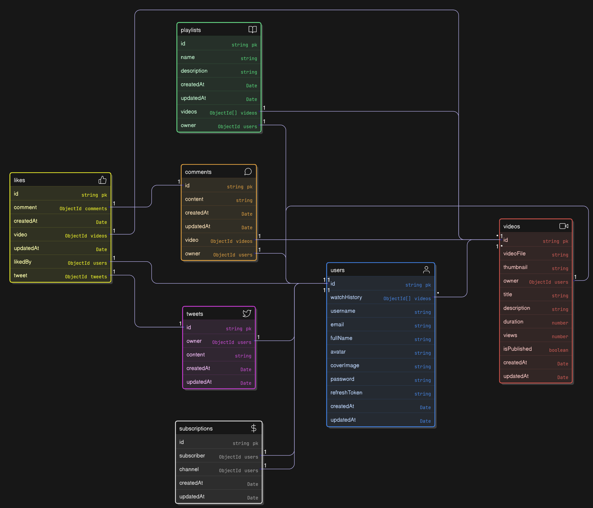

#  VideoTube API Documentation

##  Overview
VideoTube is a YouTube-like video-sharing platform with features such as video uploads, subscriptions, likes, comments, and user authentication. This API allows developers to interact with VideoTube’s backend using RESTful endpoints.

---
## 📂 Data Model
Heres the Data Model Link:
- [`Model_Link`](https://app.eraser.io/workspace/ovt3zEJbt1j4ZUbNRQUh?origin=share) ( check it out )


---

## 🔧 Services Used
- **MongoDB Atlas** (Database)
- **Cloudinary** (File Storage)

---

## 📦 NPM Packages Used
- `nodemon`, `prettier`, `mongoose`, `express`, `dotenv`, `cookie-parser`, `cors`, `mongoose-aggregate-paginate-v2`, `bcrypt`, `jsonwebtoken`, `cloudinary`, `multer`


---

## 📂 API Endpoints
### 1️⃣ **Users** (Authentication & Profile Management)
| Method | Endpoint                 | Description |
|--------|--------------------------|-------------|
| POST | `/users/login`           | Login user |
| POST | `/users/register`        | Register user |
| GET  | `/users/me`              | Get logged-in user details |
| PATCH| `/users/update-profile`  | Update user profile |

### 2️⃣ **Videos** (Video Management)
| Method | Endpoint                 | Description |
|--------|--------------------------|-------------|
| POST | `/videos`                | Upload a video |
| GET  | `/videos`                | Get all videos (pagination, search, sorting) |
| GET  | `/videos/:id`            | Get video by ID |
| PATCH| `/videos/:id`            | Update video details |
| DELETE | `/videos/:id`          | Delete a video |

#### **Example Request (Get Videos)**
```http
GET /videos?page=1&limit=5&query=tech
```
##### **Response**
```json
{
  "statusCode": 200,
  "data": [{ "_id": "videoId", "title": "Tech Innovations" }],
  "message": "Videos fetched successfully"
}
```

### 3️⃣ **Comments** (Video Interactions)
| Method | Endpoint                  | Description |
|--------|---------------------------|-------------|
| POST | `/comments`               | Add comment to a video |
| GET  | `/comments/:videoId`      | Get comments for a video |
| PATCH| `/comments/:id`           | Update a comment |
| DELETE| `/comments/:id`          | Delete a comment |

### 4️⃣ **Likes** (Likes on Videos, Comments, Tweets)
| Method | Endpoint                 | Description |
|--------|--------------------------|-------------|
| POST | `/likes/video/:videoId`  | Like/unlike a video |
| POST | `/likes/comment/:commentId` | Like/unlike a comment |
| POST | `/likes/tweet/:tweetId`  | Like/unlike a tweet |

### 5️⃣ **Subscriptions** (User Following System)
| Method | Endpoint                   | Description |
|--------|----------------------------|-------------|
| POST | `/subscriptions/:channelId` | Subscribe/Unsubscribe a channel |
| GET | `/subscriptions`            | Get user’s subscribed channels |
| GET | `/subscriptions/:channelId` | Get subscribers of a channel |

### 6️⃣ **Tweets** (Micro-posting System)
| Method | Endpoint                   | Description |
|--------|----------------------------|-------------|
| POST | `/tweets`                   | Create a tweet |
| GET  | `/tweets/:userId`           | Get user’s tweets |
| PATCH| `/tweets/:tweetId`          | Update a tweet |
| DELETE| `/tweets/:tweetId`         | Delete a tweet |

### 7️⃣ **Dashboard** (Channel Stats & Analytics)
| Method | Endpoint                    | Description |
|--------|-----------------------------|-------------|
| GET  | `/dashboard/stats/:channelId` | Get channel stats (views, subscribers, videos, likes) |
| GET  | `/dashboard/videos/:channelId` | Get channel’s uploaded videos |

---

## 🔐 Authentication
### **JWT-Based Authentication**
Most endpoints require authentication via a Bearer Token.

---

## 📌 Testing with Postman
To test the API, import the Postman Collection:
🔗 **[Postman Collection Link](https://documenter.getpostman.com/view/39785900/2sAYdfpWHD)** (check it out)

1. Open **Postman** → Click **Import** → Paste the link.
2. Set up **Authorization** (`Bearer Token`) if required.
3. Select an **endpoint**, enter parameters, and test it.

---

## 🏆 Conclusion
This API serves as the backbone of **VideoTube**, allowing seamless interaction for users, videos, comments, likes, and more. It is **secure, scalable, and well-structured**. 

For contributions or reporting issues, connect with me on **LinkedIn**!

---

_© Created by **Mustansir Agashiwala**_
